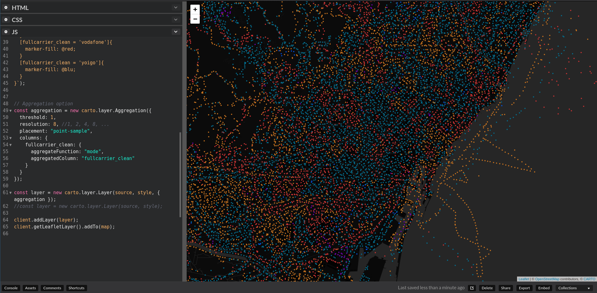
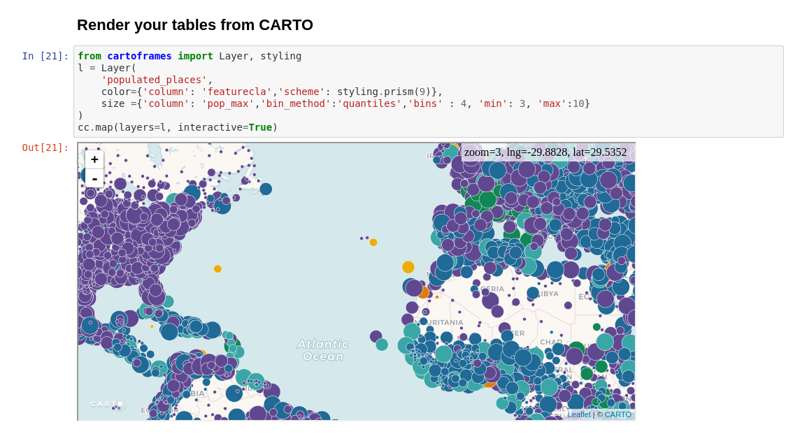

## CARTO ENGINE 2018

|   |   |
|:--|--:|
| `Space`, `Page Forward` or `→` | forward |
| `Page Back` or `←`             | back  |
| `S`                        | notes |
| `Esc`                      | overview |
| `F`                        | full screen |

---

# CARTO ENGINE 2018

<!-- .element style="font-size:1.7em"-->

Jorge Sanz · [@xurxosanz](https://twitter.com/xurxosanz) · jorge@carto.com

[bit.ly/1806-carto-engine](http://bit.ly/1806-carto-engine)

Note:

### Abstract:

CARTO is a successful service and Open Source product stack used by organizations of all sizes and verticals. Its portfolio is mainly divided into two main products: BUILDER and ENGINE. This talk is about the latter, exploring how to use the CARTO platform to develop your geospatial applications with a complete set of services, APIs, and client components.

---

<!-- .element data-background="../resources/carto/wallpapers/prediction-blue.png"  class="only-background"-->

---

<!-- .element data-background="../resources/images/city.png" class="only-background"-->

<h3>
<strong>CARTO</strong> is the platform  
for turning location data 
 into business outcomes
</h3>

Note:

CARTO is an offering for organizations and individuals to obtain value from geospatial information. That offering is formed by technology stack that will review in a minute.

___

<!-- .element data-background="../resources/images/jefferson-santos-450403-unsplash.jpg" -->

## Open Source

[github.com/CartoDB](https://github.com/CartoDB)

Note:

But CARTO is also an Open Source effort, we develop CARTO in our GitHub organization, and these are the main repositories. Let's take a look to the main repository statistics.
___

<blockquote style="width:80%;font-size:smaller;">
22 Pull Requests. That&#39;s how many <a href="https://twitter.com/CARTO?ref_src=twsrc%5Etfw">@CARTO</a> teammates have made to non-CARTO-owned open source projects in roughly the last month, including <a href="https://twitter.com/mapnikproject?ref_src=twsrc%5Etfw">@mapnikproject</a> , <a href="https://twitter.com/postgis?ref_src=twsrc%5Etfw">@postgis</a> and <a href="https://twitter.com/OSGeo?ref_src=twsrc%5Etfw">@OSGeo</a> projects. Glad to be at a company that practices open source!
&mdash; Andrew Thompson (@andrewbt) <a href="https://twitter.com/andrewbt/status/971523061517348864?ref_src=twsrc%5Etfw">March 7, 2018</a></blockquote>

___

<!-- .element data-background="../resources/images/carto-team-map.png" class="only-background"-->

___

<!-- .element data-background="../resources/images/carto-retreat.jpg" class="only-background"-->

---

<!-- .element data-background="../resources/carto/wallpapers/location-red.png" class="only-background"-->

---

<!-- .element data-background="../resources/images/igor-ovsyannykov-252351-unsplash.jpg" class="only-background"-->

# **ENGINE**

 <!-- .element style="width:800px;" -->

Note:

The technology stack in CARTO is like this, 

* we have at the data layer Postgres and PostGIS but also other services that can enrich your data with demographic information, routing, and so on.
* on top of it a set of APIs that allow to interact with your data to import information, render tiles, get raw results, etc
* above we have the web and caching servers and in our cloud, a smart CDN that makes maps fast and easy to consume even on demanding scenarios like election maps
* at the user level, besides BUILDER we have the different clients and development kits to interact with the platform as we'll see later.

___

<!-- .element data-background="../resources/images/lena-bell-68534-unsplash.jpg" -->

## Maps API

* Supports raster and **vector** tiles
* Supports **TileJSON** format
* Smart **aggregations** on the fly

___

[Demo: Maps API, vector tiles and Mapbox.GL](https://codepen.io/jsanz/pen/mXbVXd?)

___

[Demo: Maps API, smart aggregation and CARTO.js 4](https://codepen.io/jsanz/pen/yvebrg?editors=0010)

---

<!-- .element data-background="../resources/carto/wallpapers/navy-blue.png" class="only-background"-->

---

## CartoFrames

* https://github.com/CartoDB/cartoframes
* https://carto.com/blog/inside/CARTOframes-python-interface-CARTO/
* **Jupyter** and **Pandas** are becoming standards for Data Scientists
* We want them to use CARTO without leaving their tools
* Pandas **DataFrame** integration and **Leaflet** inside Jupyter
___

[Example](http://nbviewer.jupyter.org/github/CartoDB/carto-workshop/blob/master/06-sdks/exercises/python_SDK/CARTO_Frames.ipynb)
___

[Example](http://nbviewer.jupyter.org/github/CartoDB/carto-workshop/blob/master/06-sdks/exercises/python_SDK/CARTO_Frames.ipynb)
___

## CARTO.js

* https://github.com/cartodb/cartodb.js/tree/v4 (to be relased soon)
* **Low-level** approach, dev friendly and easier to integrate
* Supports **Leaflet** and **Google Maps**
* Focused in **raster** tiles
* **Dataviews** (widgets model), dynamic **legends** and **metadata**
* New [documentation](https://carto.com/documentation/cartojs/) with full [API](https://cartodb.github.io/documentation/carto-js/reference/) and examples

___

https://carto.com/blog/inside/cartojs-and-react/

---

<!-- .element data-background="../resources/carto/wallpapers/prediction-blue.png"  class="only-background"-->

___

https://carto.com/developers/

---

<!-- .element data-background="../resources/carto/wallpapers/purple.png" class="only-background"-->

___

# CARTO VL

___

<!-- .element data-background="../resources/images/city.png" -->

## Thanks!

Jorge Sanz · [@xurxosanz](https://twitter.com/xurxosanz) · jorge@carto.com

[bit.ly/1806-carto-engine](http://bit.ly/1806-carto-engine)

___

## Pictures attributions

<ul>
<li><a href="https://unsplash.com/photos/9SoCnyQmkzI">Jefferson Santos</a></li>
<li><a href="https://unsplash.com/photos/Gecsh_1GOz4">Josh Bean</a></li>
<li><a href="https://unsplash.com/photos/HFG53IIJ8y0">Igor Ovsyannykov</a></li>
<li><a href="https://unsplash.com/photos/mluSdDeOksc">Lena Bell</a></li>
<li><a href="https://unsplash.com/photos/iPt41beW5rs">Thomas Kelley</a></li>
<li><a href="https://unsplash.com/photos/OPzWvgL-upY">Giammarco Boscaro</a></li>
</ul>
